# CFDVulkan
A cfd solver implemented with the VulkanAPI for GPU compute

To get more information on special blocks and the GPU implementation see the `Documentation_Group_D.pdf`. More detailed explanations will come in the future...

## How to run the project

The code supports 3 different ways to run the code
## Standard
One way is to run the simulation on 1 core:
```
./sim fluid_trap
```

, where sim is the name of the executable created and the simulation speciefied by fluid_trap is run.
## Gpu Acceleration
Secondly one can run the simulation with Gpu acceleration:
```
./sim fluid_trap
```

The execution of the simulation is the same, but in the fluid_trap.dat file the parameter GpuIndex has to be speciefied to a non negative number.

## Multicore Acceleration
Last but not least teh program can also be run on multiple threads:
```
mpiexec -n 4 ./sim fluid_trap
```

This runs the fluid trap problem in the excercise on 4 threads. Specify iproc and jproc parameters accordingly in the .dat file (e.g. iproc=2, jproc=2 for 2x2 grid).
If iprox * jproc not equals the number of threads, an error message will be printed out and the program is aborted.

The following options are available:

* moving_lid
* planar_shear_flow
* karman_vortex_street
* flow_over_step
* natural_convection
* rayleigh_benard_convection
* fluid_trap

The problem and geometry files are in the folder _simulation_settings_ and will be automatically read from that.
To create new simulations one can simply create a new .dat file and edit the simulation settings. To run the new simulation simply use the name of the .dat file without file ending as the parameter for the sim executable.
If one wants to create a new obstacle environment simply create a new .pgm file. The numbers in the pgm file correspond to the following cell types:
* 0: No slip boundary
* 1: Free slip boundary
* 2: Outflow boundary
* 3: Inflow boundary
* 4: Fluid

# Simulation results

## Moving Lid
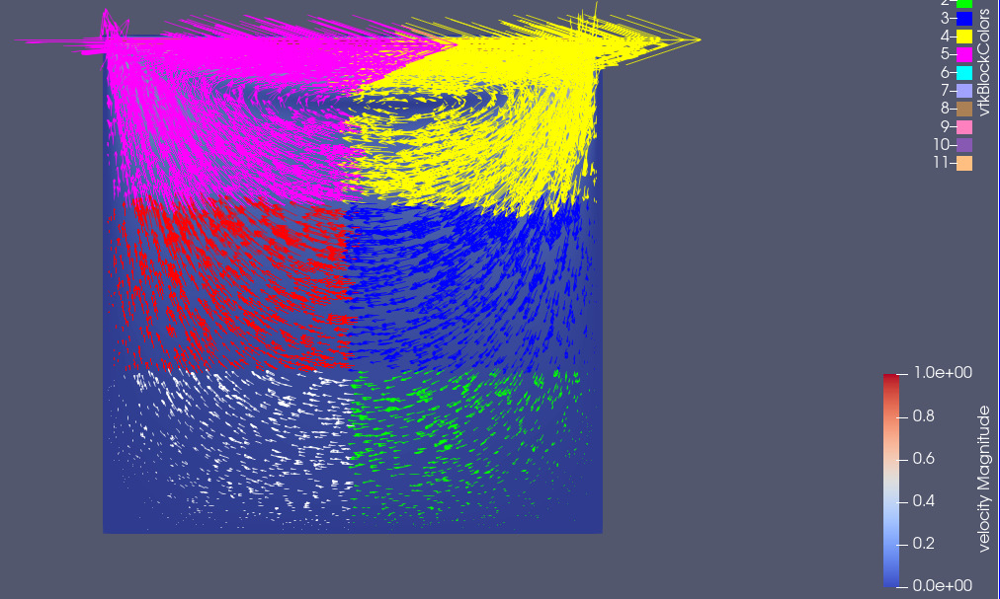
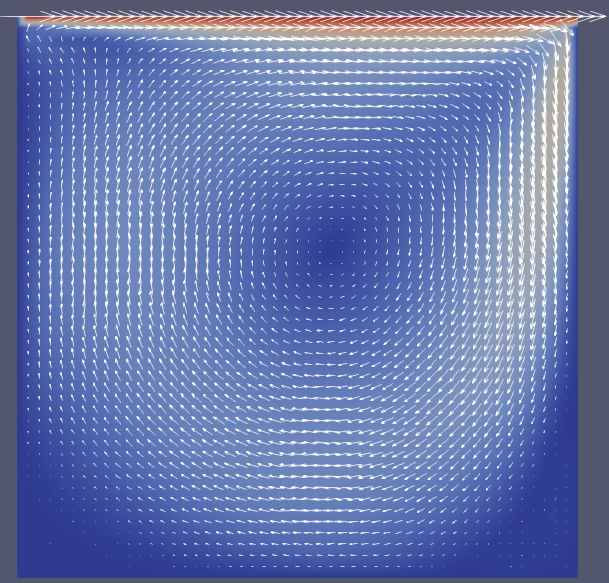
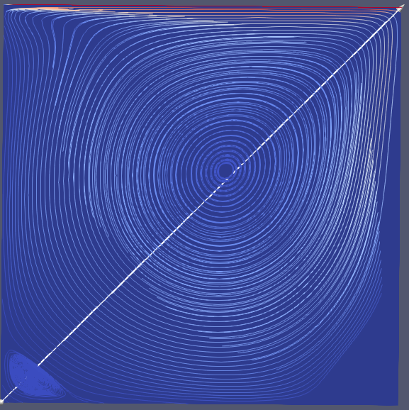
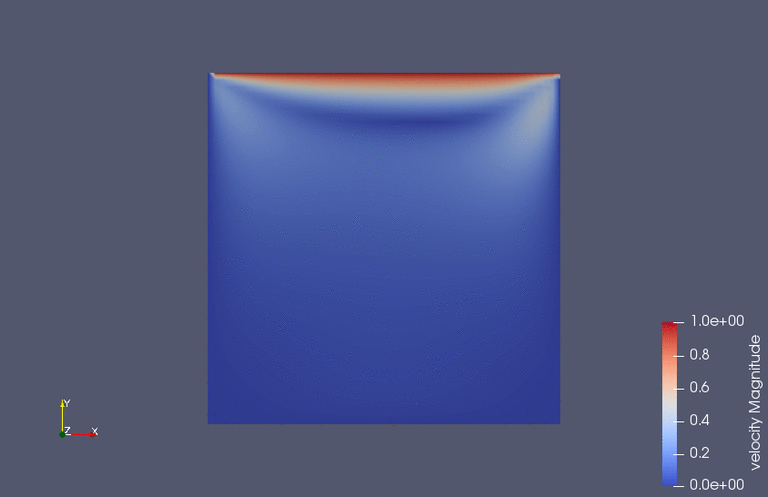
## Planar Shear Flow
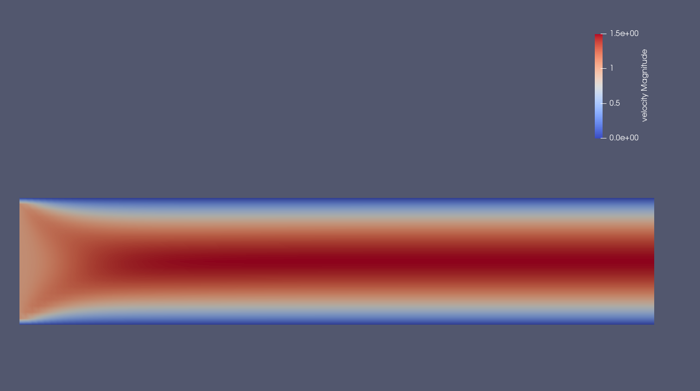
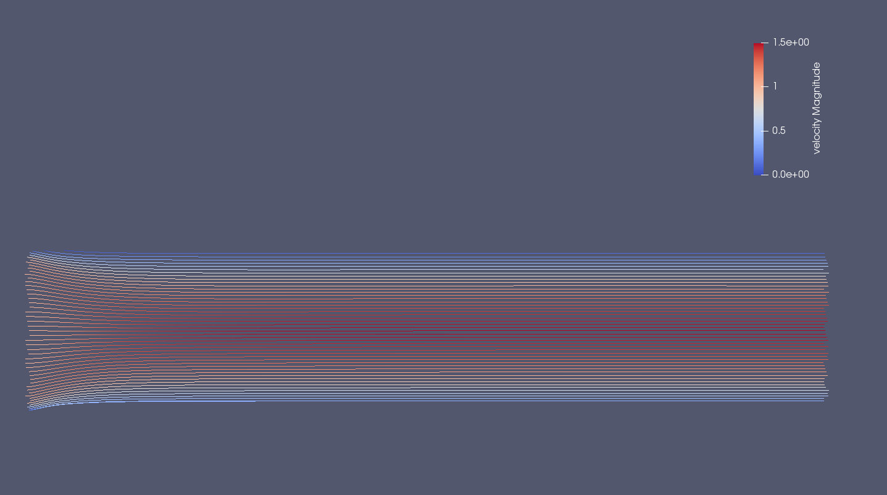
## Karman Vortex Street
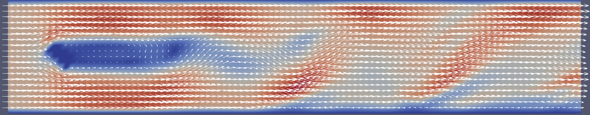
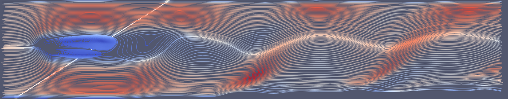
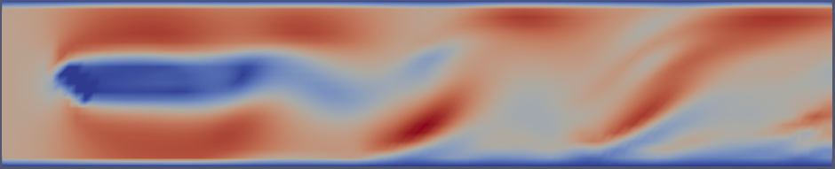
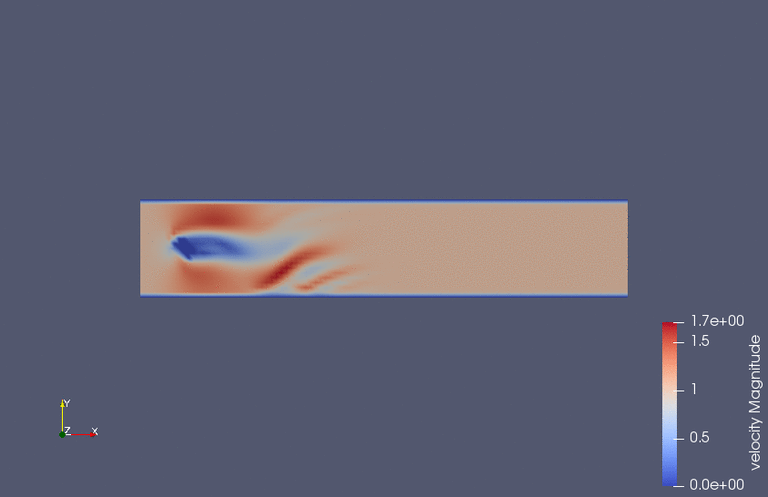
## Flow Over a Step
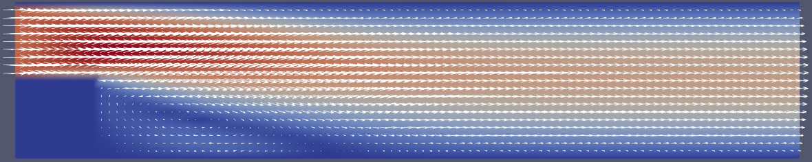
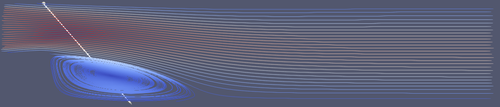

## Natural Convection
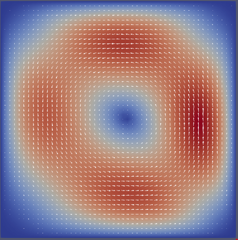

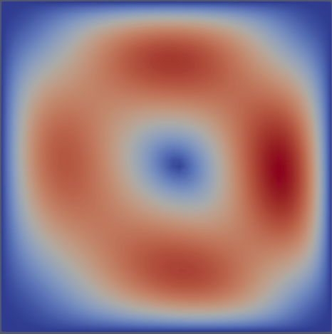

## Fluid Trap
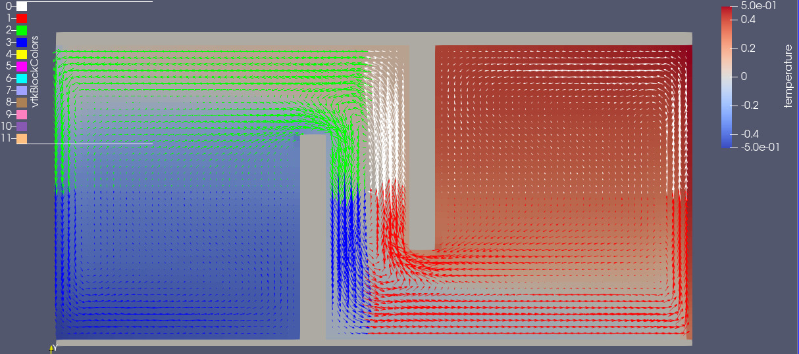


## Rayleigh Benard Convection
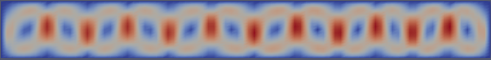
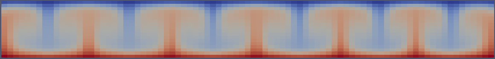
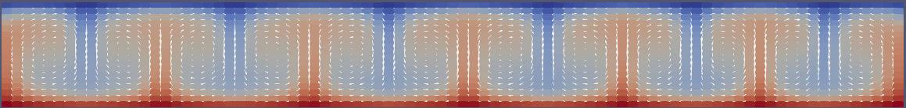


## Multithreading timings
On a pc using an intel core i5 4th gen processor with 4 x 3.2 Ghz the following timings for different simulations and different amount of threads have been measured.

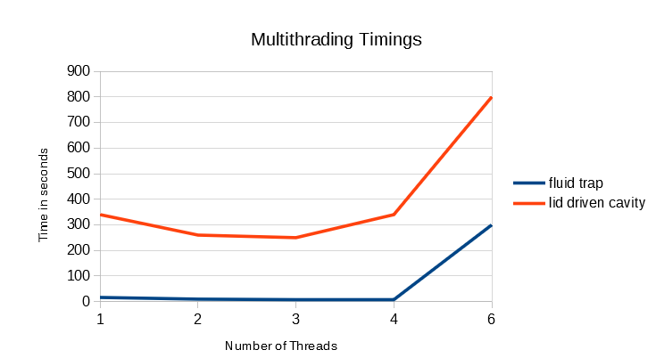

# Notes
1. In file visual.cpp:
 
Changed function signiture:

``void write_vtkFile(const char *szProblem, int timeStepNumber,double xlength, double ylength, int imax, int jmax, double dx, double dy, double** U, double** V, double** P)" ``

to

``void write_vtkFile(const char *szProblem, int timeStepNumber,double xlength, double ylength, int imax, int jmax, double dx, double dy, matrix<double> U, matrix<double> V, matrix<double> P) ``


# CFD Lab code skeleton

Code Skeleton for the CFD Lab taught at TUM Informatics

This repository contains:

* an example input file (`cavity100.dat`), with `100` stemming from the `itermax`
* the headers
* the files with the respective method stubs

Please [fork this repository and add us as collaborators](https://gitlab.lrz.de/tum-i05/public/cfdlabcodeskeleton/-/wikis/home).

Find more information in the [documentation](https://tum-i05.pages.gitlab.lrz.de/public/cfdlabcodeskeleton/).

## Software Requirements

* VTK 7 or higher
* GCC 9 (optional)
* Vulkan 1.1 or higher

### GCC version

You can get you current version of GCC by running:

```shell
g++ -v
```

### Defining your GCC version

If you have GCC 9 or newer, you can set in the `CMakeLists.txt` file:

```cmake
set(gpp9 True)
```

If you have a version lower than 9, then you don't have to modify the `CMakeLists.txt` file.

This will affect how we are using the C++ filesystem library, which is available already in GCC 7 as an experimental feature.

### Setup of VTK, GCC 9 (Ubuntu **20.04**)

```
apt-get update &&
apt-get upgrade -y &&
apt-get install -y build-essential cmake libvtk7-dev libfmt-dev
```

### Setup of VTK, GCC 9 (Ubuntu **18.04**)

If you want, you can upgrade your compiler version to have access to more recent C++ features.
This is, however, optional.

```
apt-get update &&
apt-get install -y software-properties-common &&
add-apt-repository -y ppa:ubuntu-toolchain-r/test &&
apt-get upgrade -y &&
apt-get install -y build-essential cmake libvtk7-dev libfmt-dev gcc-9 g++-9
apt-get install -y gcc-9 g++-9
```

### Setup of Vulkan
- Goto the [Vulkan website](https://vulkan.lunarg.com/sdk/home) and download the latest Vulkan SDK.
- Create a local folder and unpack the downloaded Vulkan SDK there.
- Run the 'source' command to set all needed environment variables.
```
source ~/vulkan/1.x.yy.z/setup-env.sh
```

## Using CMake

CMake is a C++ build system generator, which simplifies the building process compared e.g. to a system-specific Makefile. The CMake configuration is defined in the `CMakeList.txt` file.

In order to build your code with CMake, you can follow this (quite common) procedure:

1. Create a build directory: `mkdir build`
2. Get inside it: `cd build`
3. Configure and generate the build system: `cmake ..` (Note the two dots, this means that the `CmakeLists.txt` File is in the folder above)
4. Build your code: `make` (build the executable)

### Troubleshooting: VTK not found

You might run into a problem where the VTK library is not found. To fix this, you can try the following steps:

1. Find the installation path of your VTK library 
2. Define this path as an environment variable, as e.g. `export VTK_DIR=".../lib/cmake/vtk-8.2"`
3. Start in a clean build folder
4. Run `cmake ..` again

### Set a different GCC version

If you have multiple compiler versions installed you can set the GCC version which should be used by `cmake` like this:

```shell
export CXX=`which g++-7`
```

Make sure to use a backtick (\`) to get the `which` command executed. Afterwards, you can run `cmake ..`.

## Testing 

The folder `tests` contains example files for simple unit testing with the [Catch2](https://github.com/catchorg/Catch2) unit testing framework. The tests can be compiled using `cmake` as well.

After building, run:

```
ctest --verbose
```

With the `verbose` option you can get more details for failing tests.

## Documentation 

The generate the documentation, run:

```
pip3 install --user mkdocs mkdocs-material
```

and then serve it to be able to access it through your browser:

```
mkdocs serve
```
